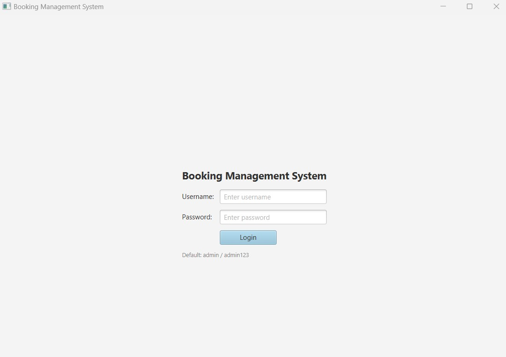
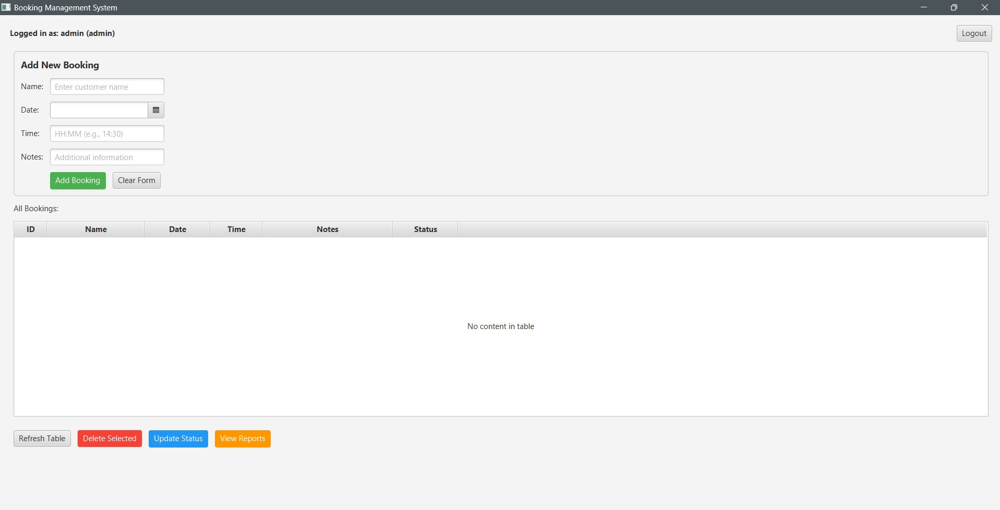

# Desktop Booking Management System

A professional desktop application for managing customer bookings with secure authentication, real-time validation, and reporting capabilities.

**Technologies:** Java | JavaFX | SQLite

---

## 📸 Screenshots

### Login Interface


### Main Dashboard


---

## Features

-  **Secure Login System** - Username and password authentication with database validation
-  **Add Bookings** - Create new reservations with customer name, date, time, and notes
-  **View All Bookings** - See all reservations in an organized table
-  **Update Status** - Change booking status (Pending → Confirmed → Completed)
-  **Delete Bookings** - Remove bookings with confirmation dialog
-  **Reports Dashboard** - View statistics and filter bookings by status
-  **Data Validation** - Ensures correct date/time format before saving
-  **Persistent Storage** - All data saved in SQLite database

---

##  How It Works

1. **Login** with your credentials (default: admin/admin123)
2. **Add a booking** by filling in the form and clicking "Add Booking"
3. **View bookings** in the table - automatically updates in real-time
4. **Update status** by selecting a booking and clicking "Update Status"
5. **View reports** to see booking statistics and filter by status
6. **Data persists** - close and reopen, your bookings are still there!

---

##  Technologies Used

| Technology | Purpose |
|-----------|---------|
| **Java 11+** | Core application logic and OOP principles |
| **JavaFX** | Desktop GUI framework for windows, buttons, and tables |
| **SQLite** | Lightweight database for storing users and bookings |
| **JDBC** | Database connectivity with prepared statements |

---

##  Project Structure

```
DesktopBookingSystem/
├── src/
│   ├── Main.java          # UI and application logic
│   ├── Booking.java       # Booking data model
│   ├── User.java          # User authentication model
│   └── DB.java            # Database operations
├── lib/
│   └── sqlite-jdbc.jar    # SQLite database driver
└── START.bat              # Easy-run script
```

---

##  Key Accomplishments

### Database-Driven Architecture
- Built complete booking system with SQLite integration
- Two-table normalized schema (users, bookings)
- Full CRUD operations (Create, Read, Update, Delete)

### Security & Validation
- **SQL Injection Prevention:** Used prepared statements instead of string concatenation
- **Input Validation:** Regex patterns for time format, required field checking
- **Data Integrity:** Transaction-safe database operations

### Object-Oriented Design
- **Model-View-Controller (MVC)** pattern for clean architecture
- **Encapsulation:** Private fields with public getters
- **Single Responsibility:** Each class handles one specific task
- **Code Reusability:** Generic methods for common operations

---

##  Code Highlights

### Secure Database Queries
```java
// Prevents SQL injection attacks
public static User authenticateUser(String username, String password) {
    String sql = "SELECT * FROM users WHERE username = ? AND password = ?";
    try (PreparedStatement ps = conn.prepareStatement(sql)) {
        ps.setString(1, username);
        ps.setString(2, password);
        // Secure parameter binding
    }
}
```

### Data Validation
```java
// Ensures time is in HH:MM format
public static boolean isValidTime(String time) {
    return time.matches("\\d{2}:\\d{2}");
}
```

### Clean Architecture
```
Model Layer:    Booking.java, User.java (data structures)
View Layer:     Main.java (UI components)
Data Layer:     DB.java (database operations)
```

---

##  Quick Start

### Prerequisites
- Java 11 or higher
- JavaFX SDK
- SQLite JDBC driver

### Run the Application
1. Download the project
2. Double-click `START.bat`
3. Login with: **username:** `admin` **password:** `admin123`
4. Start managing bookings!

### Default Login Credentials
```
Username: admin
Password: admin123
```

---

##  Database Schema

### Users Table
```sql
CREATE TABLE users (
    id INTEGER PRIMARY KEY AUTOINCREMENT,
    username TEXT NOT NULL UNIQUE,
    password TEXT NOT NULL,
    role TEXT DEFAULT 'user'
);
```

### Bookings Table
```sql
CREATE TABLE bookings (
    id INTEGER PRIMARY KEY AUTOINCREMENT,
    name TEXT NOT NULL,
    date TEXT NOT NULL,
    time TEXT NOT NULL,
    notes TEXT,
    status TEXT DEFAULT 'Pending'
);
```

---

##  What I Learned

- **Desktop Application Development** with JavaFX framework
- **Database Design** and SQL query optimization
- **Security Best Practices** for preventing SQL injection
- **Object-Oriented Programming** principles in real-world application
- **User Interface Design** for intuitive user experience
- **Data Validation** and error handling strategies

---

##  Future Enhancements

If I had more time, I would add:
- Password encryption (bcrypt)
- Email notifications for bookings
- Calendar view for bookings
- Export reports to PDF/CSV
- User registration functionality
- Booking conflict detection

---


##  Author

**[Mabutsi Kgaogelo]**
- Email: [mabutsikgaogelo@gmail.com]

---

##  Acknowledgments

Built as part of my software development portfolio to demonstrate:
- Java programming skills
- Database integration
- GUI development
- Software architecture
- Security awareness

---
